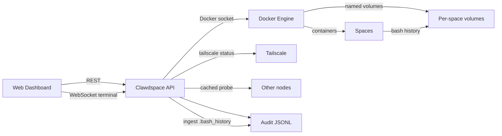

# 🚀 Clawdspace

**Self-hosted sandboxed execution environments** — run isolated “spaces” on your own machines (Docker + Tailscale).

---

## What you get

- 🐳 **Docker-based sandboxes** — one container per space
- 💾 **Persistent workspace** — per-space Docker volume mounted at `/workspace`
- ⏸️ **Auto-sleep** — idle spaces pause to save resources
- 🌐 **Dashboard** — spaces, stats, files, terminal, audit log (mobile-friendly)
- 🧭 **Multi-node (Tailscale)** — auto-discovery + cached node health
- 🎮 **GPU support** — opt-in GPU spaces (where available)
- 🧩 **Templates** — presets for resources/image/network posture
- 📝 **Audit + history** — API audit + bash history ingestion (`/workspace/.bash_history`)

---

## Architecture (at a glance)



---

## Setup (single node)

For a more detailed guide, see `docs/SETUP.md`.

### 1) Prerequisites

- Docker installed and running
- Node.js 20+ (for building the API/web)

### 2) Clone

```bash
git clone https://github.com/adam91holt/clawdspace.git
cd clawdspace
```

### 3) Create an API key

For now, Clawdspace uses a single shared secret string.

```bash
python3 - <<'PY'
import secrets
print('clawdspace_sk_live_' + secrets.token_hex(16))
PY
```

### 4) Build the sandbox image

```bash
docker build -t clawdspace:latest -f docker/Dockerfile .
```

### 5) Install deps + build

```bash
npm ci
npm run build
```

### 6) Run the API

```bash
cd packages/api
PORT=7777 API_KEY="<your_api_key>" node dist/index.js
```

Dashboard:

- `http://localhost:7777`

---

## Multi-node (Tailscale)

Clawdspace discovers nodes using `tailscale status --json` and probes each peer on port `7777`.

- `/api/nodes` is cached server-side (fast dashboard loads)
- To add a node: run the Clawdspace API on that machine (same `API_KEY`) and ensure it’s reachable over Tailscale

Override discovery:

```
CLAWDSPACE_NODES=name=http://host:7777,other=http://host2:7777
```

---

## Authentication

The server supports either:

- **Query param**: `?key=YOUR_KEY` (recommended for browsers)
- **Header**: `Authorization: Bearer YOUR_KEY` (best for curl/CLI)

Dev only:

- Disable auth with `CLAWDSPACE_AUTH_DISABLED=true`

---

## CLI

The CLI runs on your workstation and calls the API.

### Common commands

```bash
clawdspace system
clawdspace list

clawdspace create dev
clawdspace exec dev "python3 --version"
clawdspace stop dev
clawdspace start dev

clawdspace destroy dev

clawdspace dashboard
```

---

## Key API endpoints

- Health + system
  - `GET /api/health`
  - `GET /api/system`
  - `GET /api/system/capabilities`
- Spaces
  - `GET /api/spaces`
  - `POST /api/spaces` (supports `template`, optional repo clone + envfile write)
  - `POST /api/spaces/:name/exec`
  - `GET /api/spaces/:name/stats`
  - `GET /api/spaces/:name/observability`
  - `GET /api/spaces/:name/files?path=/`
  - `GET/PUT /api/spaces/:name/file?path=/foo.txt`
  - `POST /api/spaces/:name/git/push`
- Templates
  - `GET /api/templates`
  - `PUT /api/templates`
- Nodes
  - `GET /api/nodes`
- Audit
  - `GET /api/audit?space=name&limit=200`

---

## Terminal + history

- Terminal is `docker exec` over WebSocket:
  - `GET /api/spaces/:name/terminal?key=YOUR_KEY`
- The terminal runs `bash -l`
- Bash history is written to `/workspace/.bash_history` and ingested into the audit log

---

## Clawdbot integration

A snapshot of the Clawdbot extension that exposes Clawdspace as a native tool lives here:

- `clawdbot/plugins/clawdspace/`

This is the code that maps tool actions like `create_space`, `exec`, `files_get/put`, `list_spaces`, etc. to the Clawdspace HTTP API.

---

## Docs

- `docs/API.md` — REST API reference
- `docs/ARCHITECTURE.md` — system design + mermaid diagrams
- `docs/CLI.md` — CLI reference
- `docs/SETUP.md` — setup guide (API key, services, nodes)
- `docs/USAGE.md` — day 2 workflows + examples
- `docs/TROUBLESHOOTING.md` — common errors + fixes

---

Built with 🦞 (a tiny nod to the crustacean army) — keep it local, keep it yours.
