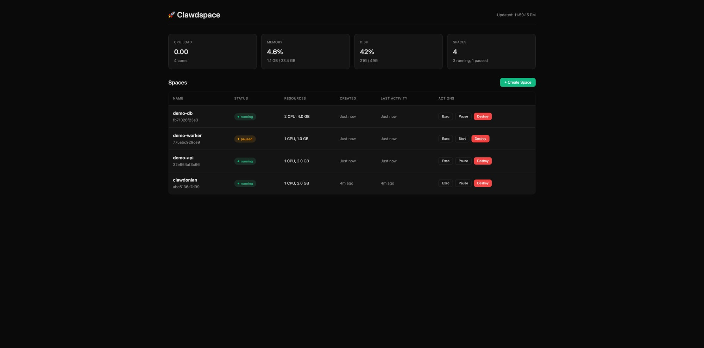
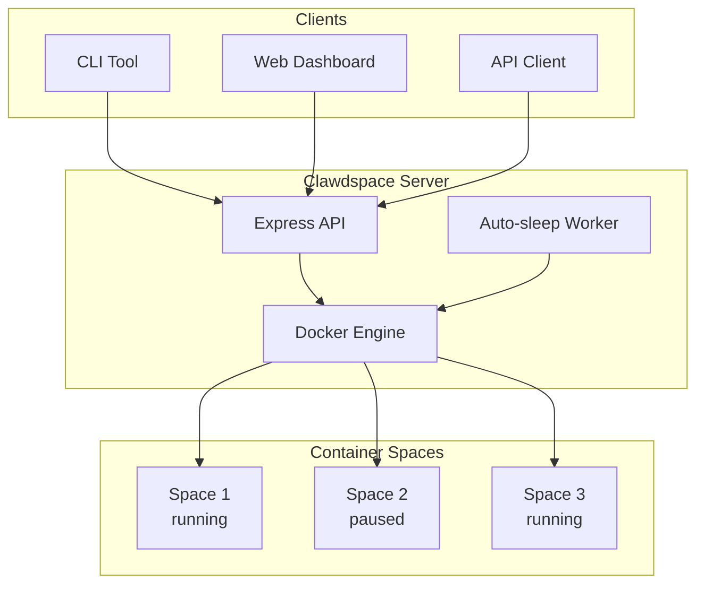
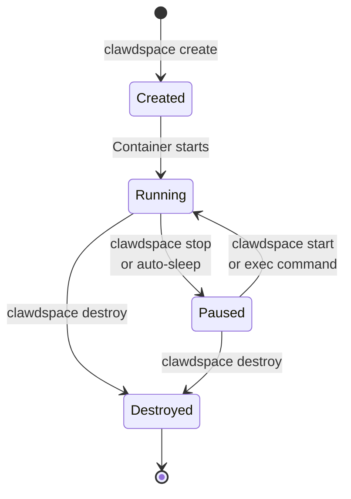

# 🚀 Clawdspace

**Self-hosted sandboxed execution environments** — like [Sprites](https://sprites.dev) but on your own infrastructure.



## Features

- 🐳 **Docker-based containers** — Isolated Linux environments
- ⏸️ **Auto-sleep** — Containers pause after idle timeout (saves resources)
- 📊 **Web Dashboard** — Real-time monitoring and management
- 🔧 **CLI Tool** — Control spaces from anywhere
- 🔌 **REST API** — Integrate with your apps
- 🔒 **API Key Auth** — Secure access control

## Quick Start

### 1. Clone & Install

```bash
git clone https://github.com/adam91holt/clawdspace.git
cd clawdspace

# Install dependencies
cd packages/api && npm install
cd ../web && npm install && npm run build
```

### 2. Build Docker Image

```bash
docker build -t clawdspace:latest -f docker/Dockerfile .
```

### 3. Start API Server

```bash
cd packages/api
API_KEY=your_secret_key npm start
```

### 4. Use CLI

```bash
# Copy CLI to your path
cp packages/cli/clawdspace /usr/local/bin/

# Configure
clawdspace config http://your-server:7777 your_secret_key

# Create a space
clawdspace create dev

# Execute commands
clawdspace exec dev "python3 --version"

# Pause (saves resources)
clawdspace stop dev

# Resume
clawdspace start dev

# Destroy
clawdspace destroy dev
```

## Architecture



## API Endpoints

| Method | Endpoint | Description |
|--------|----------|-------------|
| GET | `/api/spaces` | List all spaces |
| POST | `/api/spaces` | Create a space |
| GET | `/api/spaces/:name` | Get space details |
| DELETE | `/api/spaces/:name` | Destroy a space |
| POST | `/api/spaces/:name/stop` | Pause a space |
| POST | `/api/spaces/:name/start` | Resume a space |
| POST | `/api/spaces/:name/exec` | Execute command |
| GET | `/api/system` | System stats |

## Space Lifecycle



## CLI Commands

```bash
clawdspace create <name> [--memory 2g] [--cpus 1]  # Create space
clawdspace list                                     # List spaces
clawdspace exec <name> <command>                    # Run command
clawdspace stop <name>                              # Pause space
clawdspace start <name>                             # Resume space
clawdspace destroy <name>                           # Delete space
clawdspace status <name>                            # Show details
clawdspace system                                   # Server stats
clawdspace dashboard                                # Open web UI
clawdspace config <url> <key>                       # Configure
```

## Configuration

### Environment Variables

| Variable | Default | Description |
|----------|---------|-------------|
| `PORT` | `7777` | API server port |
| `API_KEY` | `clawdspace_dev_key` | API authentication key |
| `IDLE_TIMEOUT_MS` | `600000` (10 min) | Auto-sleep timeout |
| `CLAWDSPACE_IMAGE` | `clawdspace:latest` | Docker image for spaces |

### CLI Config File

The CLI stores configuration in `~/.clawdspace`:

```bash
CLAWDSPACE_URL="http://your-server:7777"
CLAWDSPACE_KEY="your_api_key"
```

## Development

### API Server

```bash
cd packages/api
npm install
npm run dev  # Watch mode
```

### Web Dashboard

```bash
cd packages/web
npm install
npm run dev  # Vite dev server
```

## Testing

### Unit Tests (mocked Docker)

```bash
cd packages/api
npm test              # Run once
npm run test:watch    # Watch mode
npm run test:coverage # With coverage
```

### Integration Tests (requires Docker)

```bash
# Build the sandbox image first
docker build -t clawdspace:latest -f docker/Dockerfile .

# Run with Docker enabled
TEST_DOCKER=true npm test
```

### Test Coverage

Tests cover:
- ✅ API endpoints (CRUD operations)
- ✅ Space lifecycle (create → exec → stop → start → destroy)
- ✅ Input validation (names, parameters)
- ✅ Error handling (404s, conflicts)
- ✅ Command execution (stdout, stderr, exit codes)
- ✅ Auto-resume on exec
- ✅ Memory parsing

## Deployment

### Systemd Service

```ini
[Unit]
Description=Clawdspace API Server
After=network.target docker.service
Requires=docker.service

[Service]
Type=simple
User=root
WorkingDirectory=/opt/clawdspace/packages/api
Environment=PORT=7777
Environment=API_KEY=your_secret_key
ExecStart=/usr/bin/node dist/index.js
Restart=always
RestartSec=10

[Install]
WantedBy=multi-user.target
```

## Tech Stack

- **API**: TypeScript, Express, Dockerode
- **Web**: React, Vite, TypeScript
- **CLI**: Bash
- **Containers**: Docker

## License

MIT

---

Built with 🦈 by [Kev](https://github.com/adam91holt)
