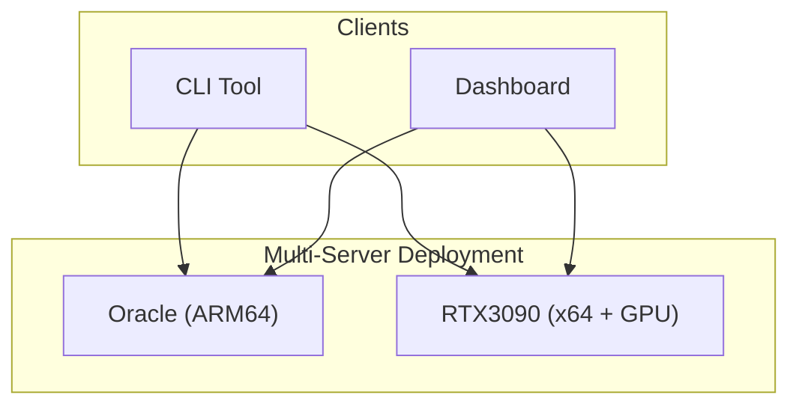

# 🚀 Clawdspace

**Self-hosted sandboxed execution environments** — like [Sprites](https://sprites.dev) but on your own infrastructure.


## Features

- 🐳 **Docker-based sandboxes** — Isolated Linux environments per space
- 🖥️ **Multi-server** — Run across multiple machines (ARM, x64, GPU)
- 🔍 **Auto-discovery** — Finds Clawdspace servers on your Tailscale network
- 🎮 **GPU support** — Native NVIDIA GPU passthrough for ML workloads
- ⏸️ **Auto-sleep** — Containers pause after idle timeout (saves resources)
- 📊 **Web Dashboard** — Real-time monitoring and management
- 🔧 **CLI Tool** — Control spaces from anywhere

## Quick Start

### 1. Clone & Build

```bash
git clone https://github.com/adam91holt/clawdspace.git
cd clawdspace

# Build Docker image
docker build -t clawdspace:latest -f docker/Dockerfile .

# Install & build API
cd packages/api
npm install
npm run build

# Install & build Web
cd ../web
npm install
npm run build
```

### 2. Start Server

```bash
cd packages/api
API_KEY=your_secret_key npm start
```

Dashboard available at `http://localhost:7777`

### 3. Use CLI

```bash
# Copy CLI to path
cp packages/cli/clawdspace /usr/local/bin/

# Discover servers
clawdspace servers --refresh

# Create a space
clawdspace create dev

# Run commands
clawdspace exec dev "python3 --version"

# Create GPU space (auto-selects GPU server)
clawdspace create ml --gpu --memory 16g

# List all spaces
clawdspace list
```

## Architecture



## GPU Support

```bash
# Check for GPU servers
clawdspace servers
# NAME       URL                         STATUS   CAPABILITIES
# rtx3090    http://100.64.248.29:7777   online   🎮 3090

# Create GPU-enabled space
clawdspace create training --gpu --memory 16g

# Run PyTorch
clawdspace exec training "python3 -c 'import torch; print(torch.cuda.get_device_name(0))'"
# NVIDIA GeForce RTX 3090
```

## Documentation

- [CLI Reference](docs/CLI.md) — All commands and options
- [API Reference](docs/API.md) — REST API documentation
- [Architecture](docs/ARCHITECTURE.md) — System design and diagrams

## API Endpoints

| Method | Endpoint | Description |
|--------|----------|-------------|
| GET | `/api/spaces` | List all spaces |
| POST | `/api/spaces` | Create a space |
| GET | `/api/spaces/:name` | Get space details |
| DELETE | `/api/spaces/:name` | Destroy a space |
| POST | `/api/spaces/:name/stop` | Pause a space |
| POST | `/api/spaces/:name/start` | Resume a space |
| POST | `/api/spaces/:name/exec` | Execute command |
| GET | `/api/system` | System info + capabilities |

## CLI Commands

```bash
clawdspace servers [--refresh]      # List/discover servers
clawdspace create <name> [options]  # Create space
clawdspace list                     # List all spaces
clawdspace exec <name> <command>    # Run command
clawdspace stop <name>              # Pause space
clawdspace start <name>             # Resume space
clawdspace destroy <name> [-f]      # Delete space
clawdspace system                   # Server stats
```

**Create Options:**
```bash
--server, -s <name>   # Target server
--memory, -m <size>   # Memory limit (e.g., "4g")
--cpus, -c <n>        # CPU cores
--gpu, -g             # Enable GPU passthrough
```

## Configuration

### Server Environment

```bash
PORT=7777                           # API port
API_KEY=your_secret_key             # Authentication
IDLE_TIMEOUT_MS=600000              # Auto-sleep (10 min)
CLAWDSPACE_IMAGE=clawdspace:latest  # Default image
```

### CLI Config (`~/.clawdspace`)

```bash
CLAWDSPACE_KEY="your_api_key"
CLAWDSPACE_HOSTS="server1 server2 192.168.1.100"
```

## Development

```bash
# API (watch mode)
cd packages/api && npm run dev

# Web (Vite dev server)
cd packages/web && npm run dev

# Run tests
cd packages/api && npm test
```

## Testing

```bash
cd packages/api

# Unit tests (mocked Docker)
npm test

# Integration tests (requires Docker)
TEST_DOCKER=true npm test

# Coverage
npm run test:coverage
```

## Deployment

### Systemd Service

```ini
[Unit]
Description=Clawdspace API Server
After=docker.service

[Service]
User=your-user
WorkingDirectory=/path/to/packages/api
Environment=PORT=7777
Environment=API_KEY=your_key
ExecStart=/usr/bin/node dist/index.js
Restart=always

[Install]
WantedBy=multi-user.target
```

```bash
sudo systemctl enable --now clawdspace
```

## Tech Stack

| Component | Technology |
|-----------|------------|
| API | TypeScript, Express, Dockerode |
| Web | React, Vite, TypeScript |
| CLI | Bash |
| Containers | Docker |
| GPU | NVIDIA Container Toolkit |

## Roadmap

- [ ] Checkpoint/restore (CRIU)
- [ ] File upload/download
- [ ] Web terminal
- [ ] Usage tracking
- [ ] Clawdbot integration

## License

MIT

---

Built with 🦈 by [Adam](https://github.com/adam91holt)
