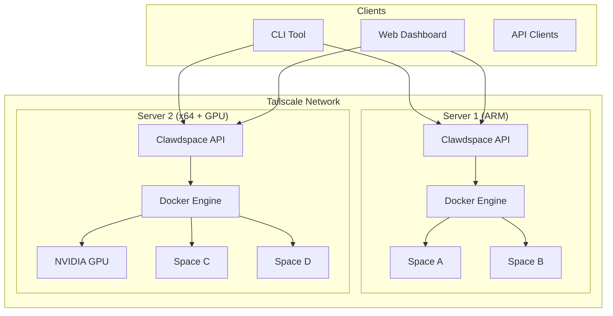
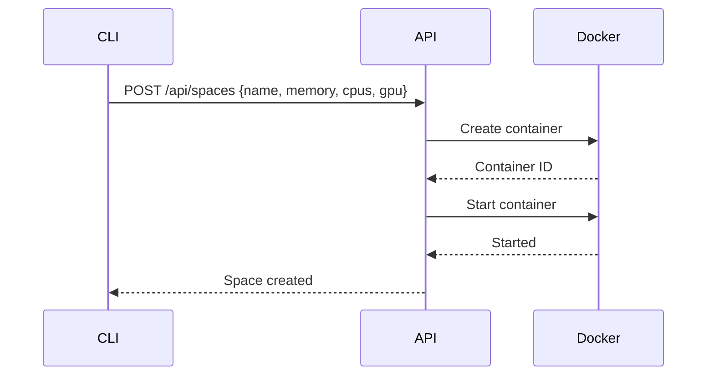
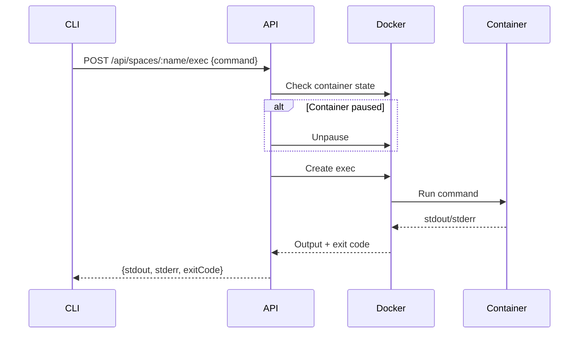
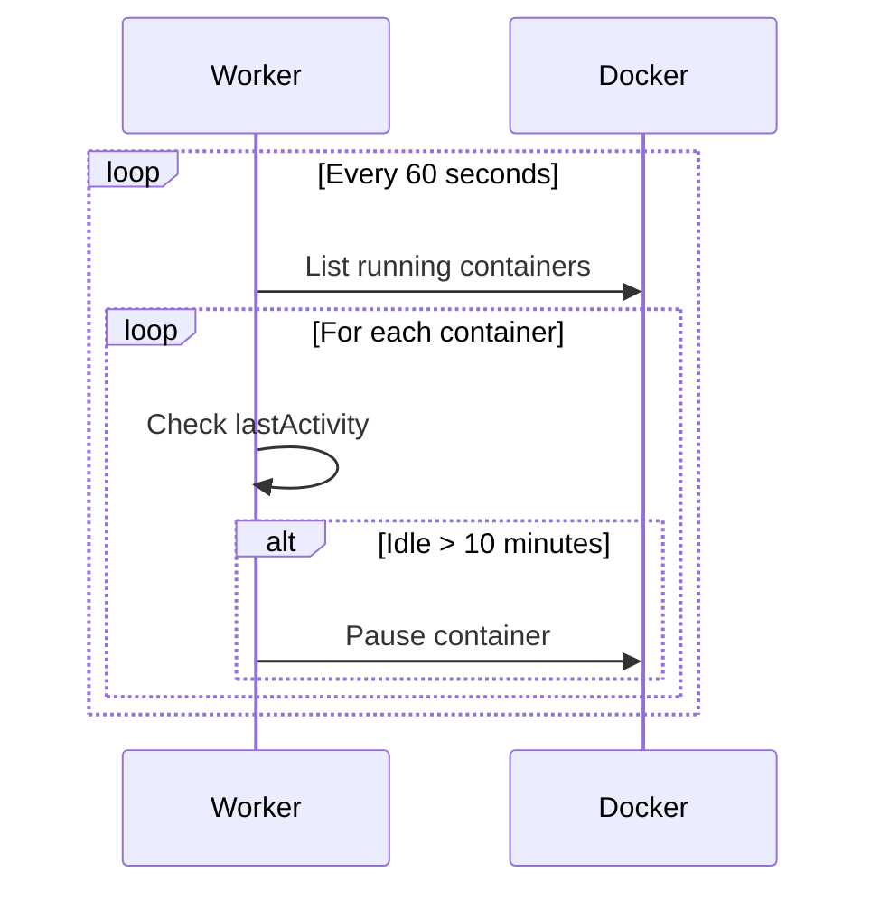
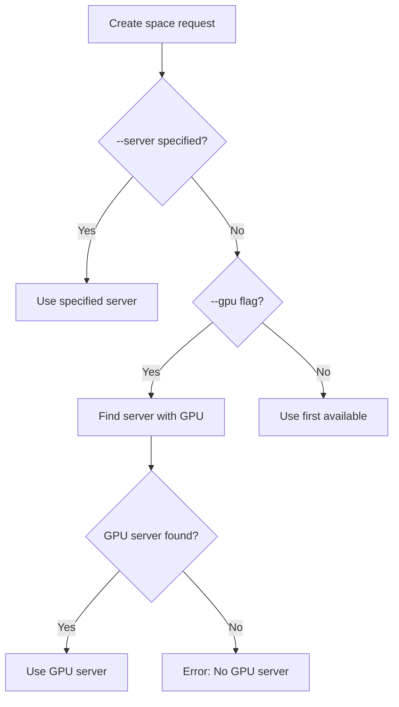

# Clawdspace Architecture

## Overview

Clawdspace is a self-hosted sandboxed execution environment platform, similar to [Sprites](https://sprites.dev) but running on your own infrastructure.

## High-Level Architecture



## Components

### 1. API Server

**Tech Stack:** TypeScript, Express, Dockerode

**Responsibilities:**
- REST API for space management
- WebSocket support for streaming exec
- Authentication via API keys
- Auto-sleep worker for idle spaces
- GPU capability detection

**Key Files:**
```
packages/api/
├── src/
│   ├── index.ts          # Express server setup
│   ├── docker.ts         # Docker operations
│   ├── types.ts          # TypeScript types
│   └── routes/
│       ├── spaces.ts     # Space CRUD + exec
│       └── system.ts     # System info + capabilities
```

### 2. Web Dashboard

**Tech Stack:** React, Vite, TypeScript

**Features:**
- Real-time space monitoring
- System resource visualization
- Create/stop/start/destroy spaces
- Execute commands

**Key Files:**
```
packages/web/
├── src/
│   ├── App.tsx           # Main application
│   ├── api.ts            # API client
│   └── components/
│       ├── SpaceList.tsx
│       ├── SystemStats.tsx
│       ├── CreateModal.tsx
│       └── ExecModal.tsx
```

### 3. CLI Tool

**Tech Stack:** Bash

**Features:**
- Auto-discovery of servers on Tailscale
- GPU-aware server selection
- All CRUD operations
- Cached server list for performance

### 4. Docker Images

**Base Image:** `clawdspace:latest`
- Ubuntu 24.04
- Python 3.12, Node.js 18
- Common dev tools

**GPU Image:** `pytorch/pytorch:2.1.0-cuda12.1-cudnn8-runtime`
- PyTorch with CUDA support
- Used automatically with `--gpu` flag

## Request Flow

### Creating a Space



### Executing a Command



### Auto-Sleep



## Multi-Server Architecture

### Discovery

The CLI discovers servers by:
1. Reading `CLAWDSPACE_HOSTS` from `~/.clawdspace`
2. Probing each host on port 7777
3. Checking for `/api/health` endpoint
4. Caching results in `~/.clawdspace-servers`

### Server Selection



### Capability Detection

Each server reports capabilities via `/api/system/capabilities`:

```json
{
  "gpu": true,
  "gpuName": "NVIDIA GeForce RTX 3090",
  "gpuMemory": "24576 MiB",
  "arch": "x64",
  "platform": "linux",
  "cpus": 12,
  "memory": 25769803776
}
```

## GPU Support

### Requirements

- NVIDIA GPU
- nvidia-docker2 or nvidia-container-toolkit
- NVIDIA drivers in Docker containers

### GPU Passthrough

When `gpu: true`:
1. API sets `DeviceRequests` in Docker config
2. Uses PyTorch image (or custom image)
3. Container runs as root (required for CUDA)
4. All GPUs passed through (`--gpus all`)

## Security

### Authentication

- API key passed via `Authorization: Bearer <key>` header
- Same key for all operations (simple model)
- Configurable via `API_KEY` environment variable

### Isolation

- Each space is a Docker container
- Resource limits enforced (CPU, memory)
- Spaces cannot access each other
- Host filesystem not mounted (by default)

### Network

- API binds to `0.0.0.0:7777`
- Recommended: Use Tailscale for secure access
- No built-in TLS (use reverse proxy for HTTPS)

## Deployment

### Single Server

```bash
# Build image
docker build -t clawdspace:latest -f docker/Dockerfile .

# Start API
cd packages/api
npm install && npm run build
API_KEY=your_key node dist/index.js
```

### Multi-Server

1. Deploy API to each server
2. Configure same API key on all servers
3. Add all server IPs to CLI config
4. Use auto-discovery or specify servers manually

### Systemd Service

```ini
[Unit]
Description=Clawdspace API Server
After=docker.service

[Service]
User=your-user
WorkingDirectory=/path/to/clawdspace/packages/api
Environment=PORT=7777
Environment=API_KEY=your_key
ExecStart=/usr/bin/node dist/index.js
Restart=always

[Install]
WantedBy=multi-user.target
```

## Environment Variables

| Variable | Default | Description |
|----------|---------|-------------|
| `PORT` | `7777` | API server port |
| `API_KEY` | `clawdspace_dev_key` | Authentication key |
| `IDLE_TIMEOUT_MS` | `600000` | Auto-sleep timeout (10 min) |
| `CLAWDSPACE_IMAGE` | `clawdspace:latest` | Default Docker image |
| `CLAWDSPACE_GPU_IMAGE` | `pytorch/pytorch:...` | Default GPU image |
